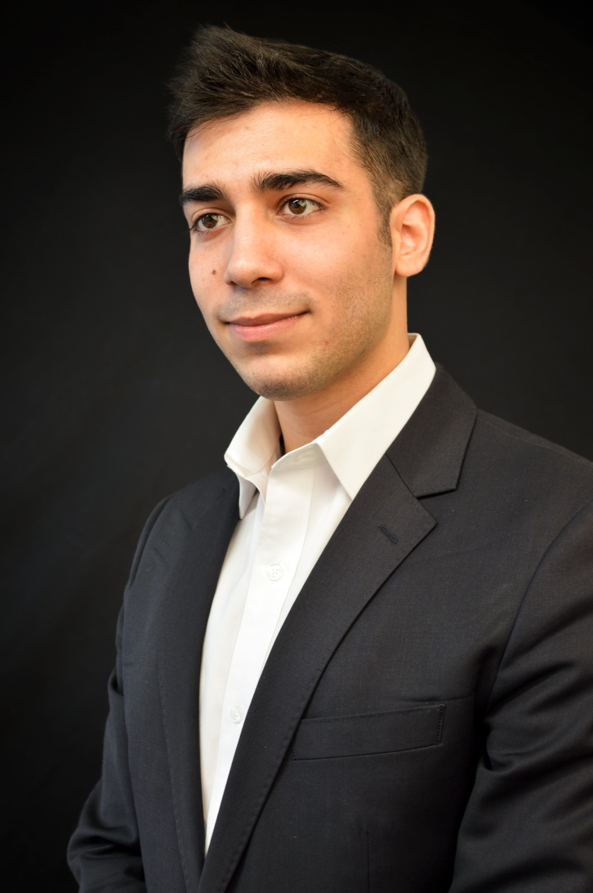
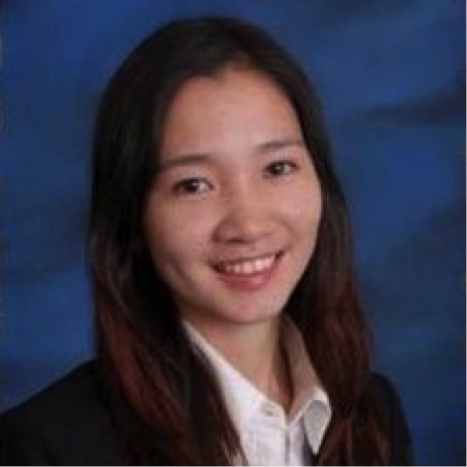

# MedBot - The Medical Chatbot  
  
## Introduction  
  
MedBot is a capstone project being undertaken by a team of Columbia University students at the [Data Science Institute](https://datascience.columbia.edu). The team consists of Andrew Satz, Jonathan Galsurkar, Minghong Zheng, Shengyang Zhang and Janak A Jain.  
  
---  

## About the Project  
  
The project is sponsored by [Synergic Partners](http://www.synergicpartners.com/en/), A Telefonica company and involves creation of a chatbot service that can communicate with a user and provide informed medical advice related to medicinal and drug prescription. The chatbot would encapsulate capabilities involving natural language processing, artifical intellgience and machine learning. We are very happy to share that we are being helped by the wonderful team at [Twilio](https://www.twilio.com/) for creating a compelling experience using their [Programmable SMS](https://www.twilio.com/sms) service.  
  
---
  
## Demo
  
Here's a sneak-peak of MediBo in action. We will update this demo video as and when we add more capabilities to it.  

<a href src="https://www.youtube.com/watch?v=sJayNZOJ1ZY">MediBo Demo</a>

---
    
## About the Team  
  
#### Andrew C Satz  
</img>

<table>
  <tr>
    <td>Andrew Satz is a Master's candidate in data science at Columbia University's School of Engineering. He comes with nearly 20 years of experience in the health insurance industry, with roles in risk management and safety. More recently, Andrew founded a data science consultancy firm focusing on the healthcare industry. Andrew is passionate about music, travel, and discovering innovative and realistic ways to utilize technology to solve the challenges of today and tomorrow.
    </td>
  </tr>
</table>  

#### Janak A Jain  
</img>

<table>
  <tr>
    <td>Janak is currently an MS candidate at Columbia University's Data Science Institute. With a rich experience in market research and consulting across several categories, he wishes to explore future steps of data across industries such as marketing, smart cities and healthcare. An MBA Tech alumnus of SVKM's NMIMS, Mumbai - his work has moved along an interesting intersection of technological and managerial spaces. He knows Hindi, English, Marathi and French with qualifications of various levels.
    </td>
  </tr>
</table>  

#### Johnny Galsurkar  
</img>

<table>
  <tr>
    <td>Jonathan Galsurkar is a final year Master's student at Columbia University studying Data Science. His team came in first place at the 2017 Columbia Data Science Hackathon. He received his Bachelor’s degree in Computer Science and Mathematics from CUNY Hunter College. He is currently a Data Science Research intern at IBM, focusing on sentence/paragraph embedding and semantic searching techniques & applications. His main goal is to use data for social good. For fun he likes to play guitar, snowboard, and travel.
    </td>
  </tr>
</table>  

#### Minghong Zheng  
</img>
<table>
  <tr>
    <td>I am very interested in applying advanced models with my business sense to do user behavior analysis. In addition, I like travelling and outdoor activities to try different things and visit as many interesting places as I can.
    </td>
  </tr>
</table>  

#### Shengyang Zhang
</img>

<table>
  <tr>
    <td>Shengyang is a graduate student at Data Science Institute, Columbia University, currently in my last semester and plan to graduate in Dec. 2017.  
Programming Languages: Python, R, MATLAB, Java, C  
Big Data/Cloud Technologies: Hadoop, Hive, Spark, Google Cloud Platform, AWS  
Tools/Packages: Tensorflow, Caffe, Theano, DyNet, NLTK, Scikit-Learn, Numpy, SciPy, pandas, keras, RShiny, Git, Tableau, matplotlib  
    </td>
  </tr>
</table>  
---  
  
## Feeback and Comments  
  
The team invites members from the larger academic and industry community to provide feeback and comments on the work. Please get in touch with the team members if you would like to know more / provide feedback about the project.  
  
